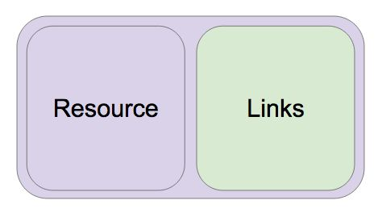

# Spring-REST-API-Study
인프런 Spring-REST-API 강좌를(백기선님) 학습하고 정리한 내용입니다.

# [섹션 1. 1. REST API 및 프로젝트 소개](#섹션-1.-1.-REST-API-및-프로젝트-소개)
* [REST API](#REST-API)
* [Event REST API](#Event-REST-API)
* [Postman & Restlet](#Postman-&-Restlet)
* [Project 만들기](#Project-만들기)
* [이벤트 도메인 구현](#이벤트-도메인-구현)
* [이벤트 비즈니스 로직](#이벤트-비즈니스-로직)

# [섹션 2. 2. 이벤트 생성 API 개발](#섹션-2.-2.-이벤트-생성-API-개발)
* [이벤트 API 테스트 클래스 생성](#이벤트-API-테스트-클래스-생성)
* [이벤트 Repository](#이벤트-Repository)
* [입력값 제한하기](#입력값-제한하기)
* [입력값 이외에 에러 발생](#입력값-이외에-에러-발생)
* [Bad Request 처리](#Bad-Request-처리)
* [Bad Request 응답](#Bad-Request-응답)
* [비즈니스 로직 적용](#비즈니스-로직-적용)
* [매개변수를 이용한 테스트](#매개변수를-이용한-테스트)

# [섹션 3. 3. HATEOAS와 Self-Describtive Message 적용](#섹션-3.-3.-HATEOAS와-Self-Describtive-Message-적용)
* [스프링 HATEOAS 소개](#스프링-HATEOAS-소개)
* [스프링 HATEOAS 적용](#스프링-HATEOAS-적용)
* [스프링 REST Docs 소개](#스프링-REST-Docs-소개)
* [스프링 REST Docs 적용](#스프링-REST-Docs-적용)
* [스프링 REST Docs 각종 문서 조각 생성하기](#스프링-REST-Docs-각종-문서-조각-생성하기)
* [스프링 REST Docs 문서 빌드](#스프링-REST-Docs-문서-빌드)
* [테스트용 DB와 설정 분리하기](#테스트용-DB와-설정-분리하기)
* [API 인덱스 만들기](#API-인덱스-만들기)

# [섹션 4. 4. 이벤트 조회 및 수정 REST API 개발](#섹션-4.-4.-이벤트-조회-및-수정-REST-API-개발)
* [이벤트 목록 조회 API 구현](#이벤트-목록-조회-API-구현)
* [이벤트 조회 API 구현](#이벤트-조회-API-구현)
* [이벤트 수정 API 구현](#이벤트-수정-API-구현)
* [테스트 코드 리팩토링](#테스트-코드-리팩토링)

# [섹션 5. 5. REST API 보안 적용](#섹션-5.-5.-REST-API-보안-적용)
* [Account 도메인 추가](#Account-도메인-추가)
* [스프링 시큐리티 적용](#스프링-시큐리티-적용)
* [예외 테스트](#예외-테스트)
* [스프링 시큐리티 기본 설정](#스프링-시큐리티-기본-설정)
* [스프링 시큐리티 폼 인증 설정](#스프링-시큐리티-폼-인증-설정)
* [스프링 시큐리티 OAuth2 인증 서버 설정](#스프링-시큐리티-OAuth2-인증-서버-설정)
* [리소스 서버 설정](#리소스-서버-설정)
* [문자열을 외부 설정으로 빼내기](#문자열을-외부-설정으로-빼내기)
* [이벤트 API 점검](#이벤트-API-점검)
* [현재 사용자 조회](#현재-사용자-조회)
* [출력값 제한하기](#출력값-제한하기)

# [섹션 6. 보강](#섹션-6.-보강)
* [깨진 테스트 살펴보기](#깨진-테스트-살펴보기)
* [스프링 부트 업그레이드](#스프링-부트-업그레이드)
* [ 함께 학습하면 좋은 로드맵](#-함께-학습하면-좋은-로드맵)
* [[초급~활용] 마이크로소프트 개발자가 알려주는 자바 스프링(spring) 완전 정복](#[초급~활용]-마이크로소프트-개발자가-알려주는-자바-스프링(spring)-완전-정복)
* [ 1443 227](#-1443-227)


# 섹션 1. 1. REST API 및 프로젝트 소개

## REST API

#### API : A​pplication​ P​rogramming ​I​nterface의 약자

### REST
* RE​presentational​S​tate​T​ransfer
* 인터넷상의 시스템간의 상호운용성(interoperability)을 제공하는 방법 중 하나
* 시스템 제각각의 ​`독립적인 ​​진화 `​를보장하기 위한 방법
* REST API: REST 아키텍처 스타일을 따르는 API

* [발표 영상](#https://www.youtube.com/watch?v=RP_f5dMoHFc)

### REST아키텍처스타일 (​발표 영상의 ​11분부터 )
* Client-Server
* Stateless
* Cache
* Uniform Interface
* Layered System
* Code-On-Demand (optional)

### Uniform Interface (발표영상11분40초)
* Identification of resources
* manipulation of resources through represenations
* [`self-descrptive messages`](#Self-descriptive-message)
* [hypermedia as the engine of appliaction state (HATEOAS)](#HATEOAS)

* #### 두문제를좀더자세히살펴보자. (발표영상37분50초)
    * ##### Self-descriptive message
      * 메시지 스스로 메시지에 대한 설명이 가능해야한다.
        * 데이터(응답메시지)만 봐서 응답 메시지가 뭘 뜻하는지(해석) 알 수 없으면 안된다. 
        * 그러므로 해석할 수 있게 API 문서의 본문을(링크, 프로필) 메시지에 담아줘야한다
         
      * 서버가 변해서 메시지가 변해도 클라이언트는 그 메시지를 보고 해석이  가능하다.
        * 메시지를 보고 해석할 수 있는 정보가 메시지 안에 담겨 있으니까.  
      * 확장가능한 커뮤니케이션
     
    * ##### HATEOAS
      * 응답에 애플리케이션 상태 변화가 가능한 하이퍼미디어 링크가 들어  있어야 한다.  
      * 하이퍼미디어(링크)를 통해 애플리케이션 상태변화가 가능해야한다.
      * 링크정보를 동적으로 바꿀 수 있다.​(Versioning할필요없이!)
      * [HATEOAS란 1.](#https://wallees.wordpress.com/2018/04/19/rest-api-hateoas/)
      * [HATEOAS란 2.](#https://pjh3749.tistory.com/260)
  

* Self-descriptive message해결방법
 
  * 방법1: 미디어타입을 정의하고 IANA에 등록하고 그 미디어타입을 리소스리턴할때 Content-Type으로사용한다.
     
  * 방법2: profile링크헤더를 추가한다. (발표영상41분50초)
    * 브라우저들이아직스팩지원을잘안해
    * 대안으로​ [HAL](#http://stateless.co/hal_specification.html)​의 링크데이터에​ [profile링크](#http://stateless.co/hal_specification.html) ​추가

* HATEOAS해결방법
* 방법1: 데이터에링크제공○ 링크를 어떻게 정의할 것인가? HAL
* 방법2: 링크 헤더나 Location을 제공

* [바람직한 Restapi 예제 - 깃허브 공식 문서](#https://docs.github.com/en/free-pro-team@latest/rest/reference/issues) 

---

## Event REST API

이벤트 등록, 조회 및 수정 API
* GET /api/events
  * 이벤트 목록 조회 REST API (로그인 안 한 상태)
    * 응답에 보여줘야 할 데이터
      * 이벤트 목록
      * 링크
        * self
        * profile: 이벤트 목록 조회 API ​문서​로 링크
        * get-an-event: 이벤트 하나 조회하는 API 링크
        * next: 다음 페이지 (optional)
        * prev: 이전 페이지 (optional)
    * 문서?
      * 스프링 REST Docs로 만들 예정

* 이벤트 목록 조회 REST API (로그인 한 상태)
    * 응답에 보여줘야 할 데이터
      * 이벤트 목록
      * 링크
        * self
        * profile: 이벤트 목록 조회 API ​문서​로 링크
        * get-an-event: 이벤트 하나 조회하는 API 링크
        * create-new-event: 이벤트를 생성할 수 있는 API 링크
        * next: 다음 페이지 (optional)
        * prev: 이전 페이지 (optional)
    
    * 로그인 한 상태???? (stateless라며..)
      * 아니, 사실은 Bearer 헤더에 유효한 AccessToken이 들어있는 경우!

* POST /api/events
  * 이벤트 생성

* GET /api/events/{id}
  * 이벤트 하나 조회

* PUT /api/events/{id}
  * 이벤트 수정

## Events API 사용 예제
1. (토큰 없이) 이벤트 목록 조회
    a. create 안 보임
2. access token 발급 받기 (A 사용자 로그인)
3. (유효한 A 토큰 가지고) 이벤트 목록 조회
    a. create event 보임
4. (유효한 A 토큰 가지고) 이벤트 만들기
5. (토큰 없이) 이벤트 조회
    a. update 링크 안 보임
6. (유효한 A 토큰 가지고) 이벤트 조회
    a. update 링크 보임
7. access token 발급 받기 (B 사용자 로그인)
8. (유효한 B 토큰 가지고) 이벤트 조회
    a. update 안 보임

* REST API 테스트 클라이언트 애플리케이션
- 크롬 플러그인 - Restlet
- 애플리케이션 - PostMan


## Postman & Restlet

## Project 만들기
추가할 의존성
* Web
* JPA
* HATEOAS
* REST Docs
* H2
* PostgreSQL
* Lombok

자바 버전 11로 시작
* 자바는 여전히 무료다

## 이벤트 도메인 구현

* 왜 @EqualsAndHasCode에서 of를 사용하는가
  * EqualsAndHasCode를 구현할 때 모든 필드를 사용하는데, 객체간의 연관관계가 있을 때, 상호 참조하는 관계가 되버리면 서로 계속 참조하여 스택 오버플로우가 발생할 수 있기 때문에 보통 id + 몇몇필드로만 비교한다. 
   
* 왜 @Builder를 사용할 때 @AllArgsConstructor가 필요한가

* 애노테이션 줄일 수 없나
  * 롬복 애노테이션은 커스텀해서 다 넣어 사용할 수 없다. -> 방법이 없다.

* @Data를 쓰지 않는 이유
  * EqualsAndHasCode도 같이 구현 해주는데, 모든 필드를 사용한다.   
    그래서 상호참조 문제 때문에 엔티티에는 사용하지 않는다.


## 이벤트 비즈니스 로직

Event 생성 API
* 다음의 입력 값을 받는다.
  * name
  * description
  * beginEnrollmentDateTime
  * closeEnrollmentDateTime
  * beginEventDateTime
  * endEventDateTime
  * location (optional) 장소. 이게 없으면 온라인 모임
  * basePrice (optional) // 참가비
  * maxPrice (optional) //  
  * limitOfEnrollment // 몇명까지 등록가능한지 제한 


* basePrice와 maxPrice의 경우의 수와 각각 로직 
 
|basePrice|maxPrice| - |
|--------|------|-------|
|0 |100 선착순 등록|
|0 |0 |무료|
|100 |0 |무제한 경매 (높은 금액 낸 사람이 등록)|
|100 |200 |제한가 선착순 등록,<br>처음 부터 200을 낸 사람은 선 등록.<br>100을 내고 등록할 수 있으나 더 많이낸 사람에 의해 밀려날 수 있음. |


# 섹션 2. 2. 이벤트 생성 API 개발

스프링 부트 슬라이스 테스트
### @WebMvcTest
  * MockMvc 빈을 자동 설정 해준다. 따라서 그냥 가져와서 쓰면 됨.
  * 웹 관련 빈만 등록해 준다. (슬라이스)

### MockMvc
  * 스프링 MVC 테스트 핵심 클래스
  * 웹 서버를 띄우지 않고도 스프링 MVC (DispatcherServlet)가 요청을 처리하는 과정을 확인할 수 있기 때문에 컨트롤러 테스트용으로 자주 쓰임.

### 테스트 할 것
* 입력값들을 전달하면 JSON 응답으로 201이 나오는지 확인.
  * Location 헤더에 생성된 이벤트를 조회할 수 있는 URI 담겨 있는지 확인.
  * id는 DB에 들어갈 때 자동생성된 값으로 나오는지 확인

* 입력값으로 누가 id나 eventStatus, offline, free 이런 데이터까지 같이 주면?
  * Bad_Request로 응답 vs ​받기로 한 값 이외는 무시

* 입력 데이터가 이상한 경우 Bad_Request로 응답
  * 입력값이 이상한 경우 에러
  * 비즈니스 로직으로 검사할 수 있는 에러
  * 에러 응답 메시지에 에러에 대한 정보가 있어야 한다.

* 비즈니스 로직 적용 됐는지 응답 메시지 확인
  * offline과 free 값 확인

* 응답에 HATEOA와 profile 관련 링크가 있는지 확인.
  * self (view)
  * update (만든 사람은 수정할 수 있으니까)
  * events (목록으로 가는 링크)

* API 문서 만들기
  * 요청 문서화
  * 응답 문서화
  * 링크 문서화
  * profile 링크 추가

---
---
### @RestController
* @ResponseBody를 모든 메소드에 적용한 것과 동일하다.

### ResponseEntity를 사용하는 이유
* 응답 코드, 헤더, 본문 모두 다루기 편한 API

### Location URI 만들기
* HATEOS가 제공하는 linkTo(), methodOn() 사용
  * org.springframework.hateoas.server.mvc.`WebMvcLinkBuilder` 패키지명으로 변경되었다. 


### 객체를 JSON으로 변환
* ObjectMapper 사용

### 테스트 할 것
* 입력값들을 전달하면 JSON 응답으로 201이 나오는지 확인.
  * Location 헤더에 생성된 이벤트를 조회할 수 있는 URI 담겨 있는지 확인.
  * id는 DB에 들어갈 때 자동생성된 값으로 나오는지 확인

## 이벤트 API 테스트 클래스 생성

## 이벤트 Repository

스프링 데이터 JPA
  * JpaRepository 상속 받아 만들기

Enum을 JPA 맵핑시 주의할 것
  * @Enumerated(EnumType.STRING)

@MockBean
  * Mockito를 사용해서 mock 객체를 만들고 빈으로 등록해 줌.
  * (주의) 기존 빈을 테스트용 빈이 대체 한다.

테스트 할 것

* 입력값들을 전달하면 JSON 응답으로 201이 나오는지 확인.
  * Location 헤더에 생성된 이벤트를 조회할 수 있는 URI 담겨 있는지 확인.
  * id는 DB에 들어갈 때 자동생성된 값으로 나오는지 확인


## 입력값 제한하기

#### 입력값 제한
* id (자동생성) 또는 입력 받은 데이터로 계산해야 하는 값들은 입력을 받지 않아야 한다.
  * 입력 받지 말아야 되는 값은 제한해야한다.  
  * ex) id 값이 100이면 안되고 free 값이 true이면 안될 경우의 테스트 
  * ```java
     mockMvc.perform(post("/api/events/")
              ... // 생략
              .andExpect(jsonPath("id").value(Matchers.not(100)))
              .andExpect(jsonPath("free").value(Matchers.not(true)))
    ```

* EventDto 적용하여 컨트롤러의 입력값을 테스트 
  * DTO -> 도메인 객체로 값 복사
    *  ModelMapper 라이브러리 
    * ```xml
      <dependency>
        <groupId>org.modelmapper</groupId>
        <artifactId>modelmapper</artifactId>
        <version>2.3.1</version>
      </dependency>
      ```
    * 공용으로 사용할 수 있기 때문에 Bean으로 등록하여 사용하는 경우가 좋다.


#### 통합 테스트로 전환
* @WebMvcTest 빼고 다음 애노테이션 추가
  * @SpringBootTest
  * @AutoConfigureMockMvc
  * EventControllerTests내의  Repository @MockBean 코드 제거
    
## 입력값 이외에 에러 발생

#### ObjectMapper 커스터마이징
* spring.jackson.deserialization.fail-on-unknown-properties=true
  * ObjectMapper 확장 기능 
  * deserialization할때 unknown-propertie가 있으면 실패하도록 설정 
  * 우리가 지정하지 않은(받을 수 없는) 프로퍼티들을 받으면 (예를들어 dto에 없는) 에러가 발생하여 400 badrequest를 리턴한다 
  * json을 object로 변환하는 과정을 deserialization
  * 객체를 json으로 변환하는 과정을 serialization

#### 테스트 할 것 
* 입력값으로 누가 id나 eventStatus, offline, free 이런 데이터까지 같이 주면?
  * Bad_Request로 응답​ vs 받기로 한 값 이외는 무시

## Bad Request 처리

#### @Valid와 BindingResult (또는 Errors)
* BindingResult는 항상 @Valid 바로 다음 인자로 사용해야 함. (스프링 MVC)
* @NotNull, @NotEmpty, @Min, @Max, ... 사용해서 입력값 바인딩할 때 에러 확인할
수 있음 - 입력값 검증 

* 어노테이션들을 이용하여 검증을 수행한 결과를 컨트롤러의 @Valid 어노테이션을 사용한 객체의 바로 다음 파라미터로 Errors 타입의 객체에다가 에러를 넣어준다. 
  * JS303 valid 관련 사용하려면 `spring-boot-starter-validation` 의존성을 추가해주면 된다. 

```java
// Controller 내 메서드

@PostMapping
public ResponseEntity createEvent(@RequestBody @Valid EventDto eventDto, Errors errors) {
    if (errors.hasErrors()) {
          return ResponseEntity.badRequest().build();
    }
    ...

    return ...
  }
```

#### 비즈니스 로직으로 입력


#### 도메인 Validator 만들기
* Validator​ 인터페이스 없이 만들어도 상관없음
테스트 설명 용 애노테이션 만들기
* @Target, @Retention


#### 테스트 할 것
* 입력 데이터가 이상한 경우 Bad_Request로 응답
  * 입력값이 이상한 경우 에러
  * 비즈니스 로직으로 검사할 수 있는 에러
  * 에러 응답 메시지에 에러에 대한 정보가 있어야 한다


## Bad Request 응답

Bad Request 응답 본문 만들기

#### 커스텀 JSON Serializer 만들기
* extends JsonSerializer<T> (Jackson JSON 제공)
* @JsonComponent (스프링 부트 제공)
  * 이 어노테이션을 사용하면 자동으로 빈으로 등록 된다. 
  * 이러면 JsonSerializer를 상속받은 Serializer를 ObjectMapper에 등록이 된다. 
 
#### BindingError
* FieldError 와 GlobalError (ObjectError)가 있음
* objectName
* defaultMessage
* code
* field
* rejectedValue

## 비즈니스 로직 적용
* 비즈니스 로직 적용 됐는지 응답 메시지 확인
  * offline과 free 값 확인


## 매개변수를 이용한 테스트

#### 테스트 코드 리팩토링
* 테스트에서 중복 코드 제거
* 매개변수만 바꿀 수 있으면 좋겠는데?
  * JUnitParams

#### JUnitParams
* https://github.com/Pragmatists/JUnitParams
  * junit4가 제공하는 @Test를 사용해야 한다 
    * junit5가 제공하는 @Test를 사용하면 오류가 난다 

* JUnit5로 사용하는법 
```xml
<dependency>
   <groupId>org.junit.jupiter</groupId>
   <artifactId>junit-jupiter-params</artifactId>
   <version>5.4.2</version>
   <scope>test</scope>
</dependency>
```
```java
@ParameterizedTest
@CsvSource({
        "0, 0, true",
        "0, 100, false",
        "100, 0, false",
})
public void testFree(int basePrice, int maxPrice, boolean isFree) {
    Event event = Event.builder()
            .basePrice(basePrice)
            .maxPrice(maxPrice)
            .build();

    event.update();

    assertThat(event.isFree()).isEqualTo(isFree);
}

@ParameterizedTest
@MethodSource("isOffline")
public void testOffline(String location, boolean isOffline) {
    Event event = Event.builder()
            .location(location)
            .build();

    event.update();

    assertThat(event.isOffline()).isEqualTo(isOffline);
}

private static Stream<Arguments> isOffline() {
    return Stream.of(
            Arguments.of("강남역", true),
            Arguments.of(null, false),
            Arguments.of("", false)
    );
}
```

# 섹션 3. 3. HATEOAS와 Self-Describtive Message 적용

## 스프링 HATEOAS 소개

스프링 HATEOAS
* https://docs.spring.io/spring-hateoas/docs/current/reference/html/
* 링크 만드는 기능
  * 문자열 가지고 만들기
  * 컨트롤러와 메소드로 만들기
* 리소스 만드는 기능
  * `리소스: 데이터(응답본문) + 링크정보`
* 링크 찾아주는 기능
  * Traverson
  * LinkDiscoverers
* 링크
  * href
  * REL(릴레이션, 현재 이 리소스와의 관계)
    * self
    * profile (응답본문에 대한 문서의 링크)
    * update-event
    * query-events



* Rest Application 아키텍처 컴포넌트 중의 하나
* 하이퍼미디어를 사용해서 애플리케이션 서버의 정보를 동적으로 클라이언트가 서버와의 정보를 주고 받을 수 방법이다.


## 스프링 HATEOAS 적용

#### EventResource 만들기
* extends ResourceSupport의 문제 
  * @JsonUnwrapped로 해결
  * extends Resource<T>로 해결

* https://docs.spring.io/spring-hateoas/docs/1.0.1.RELEASE/reference/html/
  * 버전이 바뀌면서 확인해야할 것

> * ResourceSupport is now RepresentationModel
> * Resource is now EntityModel
> * Resources is now CollectionModel
> * PagedResources is now PagedModel

* ResourceSupport, Resource 객체가 1.2.1 버전부터 각각   
   RepresentationModel, EntityModel로 변경

#### 테스트 할 것
* 응답에 HATEOA와 profile 관련 링크가 있는지 확인.
  * self (view)
  * update (만든 사람은 수정할 수 있으니까)
  * events (목록으로 가는 링크)


#### 테스트시 한글 깨짐 문제

* https://jehuipark.github.io/spring/boot-2-2-x-mock-mvc-encoding-issue


#### JSON으로 받을때 객체 이름 없이 받는법 

### `@JsonUnwrapped 어노테이션`

@Getter
public class EventResource extends RepresentationModel {

    @JsonUnwrapped
    private Event event;

    public EventResource(Event event) {
        this.event = event;
    }
}

```json
{
  "event" : -{
    "id" : 1,
    "name" : Spring,
    "description" : REST API Development with Spring,
    ...
  },
  "_links" : -{
    "query-events" : -{
      "href" : http://localhost/api/events
      },
    ...
  }
}
```
위와 같은 Json형태에서 객체 이름을 빼준다. (unwrapped)
  * "event"를 뺀다 
```json
  {
    "id" : 1,
    "name" : Spring,
    "description" : REST API Development with Spring,
    ...
  }
  "_links" : -{
    "query-events" : -{
      "href" : http://localhost/api/events
      },
    ...
  }
}
```

EntityModel를 상속받은 Resource 객체는 @JsonUnwrapped를 사용하지 않아도
unwrapped 된다. 

```java
EntityModel eventResource = EntityModel.of(newEvent);
eventResource.add(linkTo(EventController.class).slash(eventwithSelfRel());
eventResource.add(linkTo(EventController.class).withRel("query-events"));
eventResource.add(selfLinkBuilder.withRel("update-event"));
```
## 스프링 REST Docs 소개

https://docs.spring.io/spring-restdocs/docs/2.0.2.RELEASE/reference/html5/

이 라이브러리는 우리가 만든 테스트를 실행하면서 요청과 응답, 헤더 등의 정보를 사용하여 문서 조각을 만들 수 있다. (snippets라고 한다)

문서조각을 만들어서 html로 restapi documentation을 만들 수 있다. 

어떻게 스니펫(snippets)을 생성하는가?


Rest docs랑 연동할 수 있는 것

1. 테스트에서 사용하는 MockMvc도 연동가능
2. 스프링 5부터 지원하는 WebTestClient을 사용하여 연동
3. TestNG, JUnit5도 사용 가능 


```java
this.mockMvc.perform(get("/").accept(MediaType.APPLICATION_JSON))
	.andExpect(status().isOk())
	.andDo(document("index", links( // 1 
			linkWithRel("alpha").description("Link to the alpha resource"), // 2 
			linkWithRel("bravo").description("Link to the bravo resource")))); // 3
```
1. document라는 메서드를 사용해서 현재 이 테스트를 실행한 결과(snippets)을 어떤 디렉토리 아래("index")에다가 만드는 것

2.   


#### REST Docs 코딩
* andDo(document(“doc-name”, snippets))
* snippets
  * links​()
  * requestParameters() + parameterWithName()
  * pathParameters() + parametersWithName()
  * requestParts() + partWithname()
  * requestPartBody()
  * requestPartFields()
  * requestHeaders() + headerWithName()
  * requestFields​() + fieldWithPath()
  * responseHeaders() + headerWithName()
  * responseFields​() + fieldWithPath()
  * ...

* Relaxed*

* Processor
  * preprocessRequest(prettyPrint())
  * preprocessResponse(prettyPrint())
  * ...


#### Constraint
● https://github.com/spring-projects/spring-restdocs/blob/v2.0.2.RELEASE/samples/res
t-notes-spring-hateoas/src/test/java/com/example/notes/ApiDocumentation.java

## 스프링 REST Docs 적용

## 스프링 REST Docs 각종 문서 조각 생성하기

## 스프링 REST Docs 문서 빌드

## 테스트용 DB와 설정 분리하기

## API 인덱스 만들기

# 섹션 4. 4. 이벤트 조회 및 수정 REST API 개발

## 이벤트 목록 조회 API 구현

## 이벤트 조회 API 구현

## 이벤트 수정 API 구현

## 테스트 코드 리팩토링

# 섹션 5. 5. REST API 보안 적용

## Account 도메인 추가

## 스프링 시큐리티 적용

## 예외 테스트

## 스프링 시큐리티 기본 설정

## 스프링 시큐리티 폼 인증 설정

## 스프링 시큐리티 OAuth2 인증 서버 설정

## 리소스 서버 설정

## 문자열을 외부 설정으로 빼내기

## 이벤트 API 점검

## 현재 사용자 조회

## 출력값 제한하기

# 섹션 6. 보강

## 깨진 테스트 살펴보기

## 스프링 부트 업그레이드

##  함께 학습하면 좋은 로드맵

## [초급~활용] 마이크로소프트 개발자가 알려주는 자바 스프링(spring) 완전 정복

##  1443 227


Process finished with exit code 0
